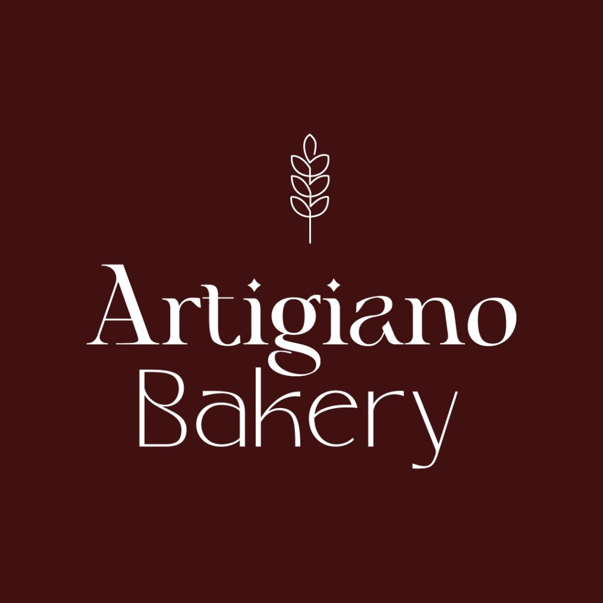

# 🥖 Artigiano Bakery - Landing Page Premium



## 📋 Descripción del Proyecto

Landing page premium en modo oscuro para **Artigiano Bakery**, una panadería artesanal especializada en pan fresco, bollería francesa, postres gourmet, catering y delivery.

### ✨ Características Principales

- 🎨 **Diseño Dark Luxury** con paleta vinotinto (#722F37) y blanco
- 🔄 **Flip Cards Interactivas** para mostrar productos (hover en desktop, tap en mobile)
- ✨ **Animaciones Premium** con partículas flotantes y efectos glassmorphism
- 📱 **100% Responsive** (Desktop XL → Mobile)
- ⚡ **Optimizado para Performance** con lazy loading y scroll animations
- 🎯 **SEO Optimizado** con meta tags y estructura semántica

---

## 🎨 Paleta de Colores

### Fondos
- **Negro Puro:** `#000000` - Fondo principal
- **Gris Ultra Oscuro:** `#09090B` - Fondo secundario
- **Gris Oscuro:** `#18181B` - Cards y elementos

### Vinotinto (Burgundy Wine Red)
- **Primary 50:** `#FDF2F4` - Tinte más claro
- **Primary 100:** `#FCE7EA` - Tinte claro
- **Primary 200:** `#F9CFD6` - Tinte medio-claro
- **Primary 300:** `#F4A5B3` - Tinte medio (textos de acento)
- **Primary 400:** `#EC6B85` - Hover states
- **Primary 500:** `#722F37` - **COLOR BASE PRINCIPAL** ⭐
- **Primary 600:** `#5A252C` - Botones activos
- **Primary 700:** `#4A1E24` - Gradientes profundos
- **Primary 800:** `#3D1A1F` - Sombra oscura
- **Primary 900:** `#2B1216` - Sombra muy oscura

### Textos
- **Blanco Puro:** `#FFFFFF` - Títulos principales
- **Gris Muy Claro:** `#E4E4E7` - Textos secundarios
- **Gris Medio:** `#A1A1AA` - Textos terciarios
- **Gris Labels:** `#71717A` - Labels y metadatos

---

## 📁 Estructura del Proyecto

```
artigiano-bakery/
├── index.html          # Estructura HTML completa
├── styles.css          # Estilos CSS con diseño vinotinto
├── script.js           # JavaScript con animaciones e interacciones
├── README.md           # Este archivo
└── images/             # Carpeta de imágenes
    ├── logo.jpg        # Logo de Artigiano Bakery (✅ YA INCLUIDO)
    ├── hero_visual.jpg # Visual principal del hero
    ├── service_bread.jpg       # Imagen de Pan Artesanal
    ├── service_pastries.jpg    # Imagen de Bollería Francesa
    ├── service_desserts.jpg    # Imagen de Postres Gourmet
    ├── service_catering.jpg    # Imagen de Catering
    ├── service_delivery.jpg    # Imagen de Delivery
    └── service_custom.jpg      # Imagen de Pedidos Especiales
```

---

## 🖼️ INSTRUCCIONES PARA AGREGAR IMÁGENES

### ✅ Logo (Ya incluido)
Tu logo ya está en `images/logo.jpg` y se usa en:
- Navbar (48px altura)
- Sección About (350px círculo)
- Footer (60px altura)

### 📸 Imágenes Faltantes que Debes Agregar

#### 1. **Hero Visual** (`images/hero_visual.jpg`)
- **Tamaño recomendado:** 1200x1200px
- **Contenido sugerido:** Composición artística de panes, croissants, o tu producto estrella
- **Estilo:** Fondo oscuro, iluminación cálida, profesional
- **Dónde conseguirla:** 
  - Foto profesional de tus productos
  - Unsplash: https://unsplash.com/s/photos/artisan-bread
  - Pexels: https://www.pexels.com/search/bakery/

#### 2. **Imágenes de Servicios** (6 imágenes)

**a) `service_bread.jpg` - Pan Artesanal**
- Panes rústicos, masa madre, integrales
- Tamaño: 800x600px (landscape)
- Unsplash: https://unsplash.com/s/photos/sourdough-bread

**b) `service_pastries.jpg` - Bollería Francesa**
- Croissants, pain au chocolat, napolitanas
- Tamaño: 800x600px (landscape)
- Unsplash: https://unsplash.com/s/photos/croissant

**c) `service_desserts.jpg` - Postres Gourmet**
- Tartas, pasteles, cheesecakes
- Tamaño: 800x600px (landscape)
- Unsplash: https://unsplash.com/s/photos/cake-dessert

**d) `service_catering.jpg` - Catering**
- Buffet, mesa con variedad de productos
- Tamaño: 800x600px (landscape)
- Unsplash: https://unsplash.com/s/photos/catering-buffet

**e) `service_delivery.jpg` - Delivery**
- Empaque premium, caja de delivery, productos listos
- Tamaño: 800x600px (landscape)
- Unsplash: https://unsplash.com/s/photos/food-delivery-box

**f) `service_custom.jpg` - Pedidos Especiales**
- Tarta personalizada, productos únicos
- Tamaño: 800x600px (landscape)
- Unsplash: https://unsplash.com/s/photos/custom-cake

### 🎯 Consejos para Seleccionar Imágenes

1. **Calidad:** Mínimo 800px de ancho, alta resolución
2. **Iluminación:** Preferir fondos oscuros o neutros que combinen con el diseño
3. **Coherencia:** Mantener un estilo fotográfico similar entre todas
4. **Apetitosas:** Que den ganas de comer (close-ups, buena iluminación)
5. **Profesionales:** Evitar fotos con celular sin buena luz

### 🔄 Cómo Reemplazar Imágenes Temporales

**Opción 1: Usar tus propias fotos (RECOMENDADO)**
1. Toma fotos profesionales de tus productos
2. Edítalas para que tengan buena iluminación
3. Guárdalas en la carpeta `images/` con los nombres exactos listados arriba

**Opción 2: Usar imágenes de stock gratuitas**
1. Ve a Unsplash.com o Pexels.com
2. Busca las categorías sugeridas arriba
3. Descarga imágenes de alta calidad
4. Renómbralas según la lista y guárdalas en `images/`

**Opción 3: Generar con IA (cuando esté disponible)**
- Espera a que el servicio de generación de imágenes esté disponible
- Usa los prompts que te proporcionaré más abajo

---

## 🚀 Cómo Usar la Landing Page

### 1. Abrir Localmente

Simplemente abre el archivo `index.html` en tu navegador:
- Doble clic en `index.html`
- O arrastra el archivo a tu navegador

### 2. Usar un Servidor Local (Recomendado)

Para mejor rendimiento, usa un servidor local:

**Con Python:**
```bash
# Python 3
python -m http.server 8000

# Luego abre: http://localhost:8000
```

**Con Node.js (npx):**
```bash
npx http-server -p 8000

# Luego abre: http://localhost:8000
```

**Con VS Code:**
- Instala la extensión "Live Server"
- Click derecho en `index.html` → "Open with Live Server"

### 3. Publicar en Internet

**Opciones gratuitas:**

**a) Netlify (Recomendado)**
1. Ve a https://www.netlify.com/
2. Arrastra la carpeta `artigiano-bakery` completa
3. ¡Listo! Tendrás una URL pública

**b) GitHub Pages**
1. Sube el proyecto a un repositorio de GitHub
2. Ve a Settings → Pages
3. Selecciona la rama y carpeta
4. Obtendrás una URL como: `https://tuusuario.github.io/artigiano-bakery`

**c) Vercel**
1. Ve a https://vercel.com/
2. Importa tu proyecto
3. Deploy automático

---

## 🎨 Personalización

### Cambiar Colores

Edita las variables CSS en `styles.css` (líneas 30-60):

```css
:root {
    /* Para cambiar el color principal, modifica estas variables */
    --primary-500: #722F37;  /* Tu color base */
    --primary-600: #5A252C;  /* Versión más oscura */
    --primary-400: #EC6B85;  /* Versión más clara */
}
```

### Cambiar Textos

Edita directamente el archivo `index.html`:
- **Nombre del negocio:** Busca "Artigiano Bakery" y reemplaza
- **Tagline:** Busca "Pan Artesanal Hecho con Pasión"
- **Servicios:** Edita las secciones de flip cards (líneas 100-300)
- **Testimonios:** Edita la sección testimonials (líneas 350-450)
- **Contacto:** Actualiza dirección, teléfono, email (líneas 500-600)

### Cambiar Estadísticas del Hero

En `index.html`, busca la sección `.hero-stats` y modifica:

```html
<div class="stat-number" data-target="28">0</div>
<div class="stat-label">Años de Experiencia</div>
```

Cambia `data-target="28"` por el número que quieras.

---

## ✨ Características Técnicas

### Animaciones Incluidas

1. **Navbar Sticky** - Se vuelve transparente con blur al hacer scroll
2. **Flip Cards** - Giran 180° al hacer hover (desktop) o tap (mobile)
3. **Contador Animado** - Las estadísticas cuentan desde 0
4. **Partículas Flotantes** - 50 partículas en desktop, 20 en mobile
5. **Scroll Reveal** - Elementos aparecen al hacer scroll
6. **Parallax Suave** - El visual del hero se mueve con el scroll
7. **Glassmorphism** - Efecto de vidrio esmerilado en cards
8. **Glow Effects** - Resplandor vinotinto en elementos clave

### Responsive Breakpoints

- **Desktop XL:** 1440px+
- **Desktop:** 1024px - 1439px
- **Tablet:** 768px - 1023px
- **Mobile:** < 767px

### Optimizaciones

- ✅ Lazy loading de imágenes
- ✅ Intersection Observer para animaciones eficientes
- ✅ Debounce en scroll events
- ✅ Reducción de partículas en mobile
- ✅ CSS con will-change para mejor performance

---

## 📞 Información de Contacto (Actualizar)

Actualiza esta información en `index.html` (sección `#contacto`):

```html
<!-- Dirección -->
<p>Calle Principal 123<br>Centro, Ciudad</p>

<!-- Teléfono -->
<p>+1 (555) 123-4567</p>

<!-- Email -->
<p>info@artigianobakery.com</p>

<!-- Horario -->
<p>Lun - Sáb: 7:00 AM - 8:00 PM<br>Dom: 8:00 AM - 2:00 PM</p>
```

---

## 🔗 Redes Sociales (Actualizar)

En el footer, actualiza los enlaces de redes sociales:

```html
<div class="social-links">
    <a href="https://facebook.com/tupage" class="social-link">📘 Facebook</a>
    <a href="https://instagram.com/tupage" class="social-link">📷 Instagram</a>
    <a href="https://twitter.com/tupage" class="social-link">🐦 Twitter</a>
</div>
```

---

## 🎯 Próximos Pasos Recomendados

### Funcionalidades Adicionales

1. **Sistema de Pedidos Online**
   - Integrar con WhatsApp Business API
   - Formulario de pedidos con carrito
   - Integración con pasarela de pago

2. **Galería de Productos**
   - Lightbox para ver imágenes en grande
   - Filtros por categoría
   - Precios y descripciones detalladas

3. **Blog de Recetas**
   - Sección de blog con recetas
   - Tips de panadería
   - Historias de clientes

4. **Integración con Google Maps**
   - Mapa interactivo de ubicación
   - Indicaciones para llegar

5. **Sistema de Reservas**
   - Calendario para catering
   - Reserva de productos especiales

---

## 📊 SEO y Marketing

### Meta Tags Incluidos

```html
<meta name="description" content="Artigiano Bakery - Pan artesanal hecho con pasión...">
<meta name="keywords" content="panadería artesanal, pan fresco, bollería...">
```

### Mejoras SEO Recomendadas

1. **Google My Business** - Crea tu perfil
2. **Schema Markup** - Agrega datos estructurados para panadería
3. **Sitemap XML** - Genera un sitemap
4. **Google Analytics** - Agrega tracking
5. **Facebook Pixel** - Para remarketing

---

## 🛠️ Tecnologías Utilizadas

- **HTML5** - Estructura semántica
- **CSS3** - Diseño y animaciones
  - Flexbox y CSS Grid
  - Custom Properties (Variables CSS)
  - Keyframe Animations
  - Backdrop Filter (Glassmorphism)
- **JavaScript (Vanilla)** - Interactividad
  - Intersection Observer API
  - Event Listeners
  - DOM Manipulation
- **Google Fonts** - Tipografía premium
  - Plus Jakarta Sans (Títulos)
  - Inter (Cuerpo)

---

## 📝 Licencia

Este proyecto fue creado específicamente para **Artigiano Bakery**.

---

## 💡 Soporte y Ayuda

### Problemas Comunes

**Las imágenes no se ven:**
- Verifica que los archivos estén en la carpeta `images/`
- Verifica que los nombres coincidan exactamente
- Usa la consola del navegador (F12) para ver errores

**Las animaciones no funcionan:**
- Asegúrate de que `script.js` esté vinculado correctamente
- Abre la consola (F12) y busca errores de JavaScript

**El diseño se ve roto en mobile:**
- Limpia la caché del navegador
- Verifica que `styles.css` esté cargando correctamente

---

## 🎉 ¡Listo para Usar!

Tu landing page está **100% funcional** y lista para recibir clientes. Solo necesitas:

1. ✅ Agregar las 7 imágenes faltantes (instrucciones arriba)
2. ✅ Actualizar información de contacto
3. ✅ Personalizar textos según tu negocio
4. ✅ Publicar en internet

---

## 📸 Prompts para Generar Imágenes con IA (Cuando esté disponible)

Si quieres generar las imágenes con IA más adelante, usa estos prompts:

### Hero Visual
```
Premium artisan bakery composition, warm golden bread loaves, croissants, and pastries arranged artistically, burgundy wine red (#722F37) accent lighting, dark luxury aesthetic with warm tones, floating flour particles, cinematic composition, depth of field, professional food photography, 4K quality, inviting and appetizing
```

### Pan Artesanal
```
Professional artisan bread loaves, rustic sourdough and whole grain breads with crispy golden crust, burgundy wine red (#722F37) accent lighting in background, dark luxury aesthetic, warm inviting tones, premium quality, modern food photography, cinematic lighting, 4K quality
```

### Bollería
```
Professional French pastries and croissants, golden flaky croissants, pain au chocolat, Danish pastries, burgundy wine red (#722F37) accent lighting, dark luxury aesthetic with warm bakery tones, premium quality, cinematic lighting, 4K quality
```

### Postres
```
Professional gourmet desserts, elegant cakes, tarts, sweet treats with artistic presentation, burgundy wine red (#722F37) accent elements, dark luxury aesthetic, premium quality, cinematic lighting, 4K quality
```

### Catering
```
Professional catering buffet setup with assorted breads, pastries and desserts beautifully arranged, burgundy wine red (#722F37) accent decor, dark luxury aesthetic, premium event setting, cinematic lighting, 4K quality
```

### Delivery
```
Professional delivery packaging, premium boxes with fresh bread and pastries, burgundy wine red (#722F37) branded packaging, dark luxury aesthetic, modern logistics, premium quality, cinematic lighting, 4K quality
```

### Pedidos Especiales
```
Professional custom bakery products, personalized cakes, custom bread shapes, bespoke pastries with elegant presentation, burgundy wine red (#722F37) accent lighting, dark luxury aesthetic, premium quality, cinematic lighting, 4K quality
```

---

**¡Disfruta tu nueva landing page premium! 🥖✨**

*Hecho con ❤️ y mucha harina*
